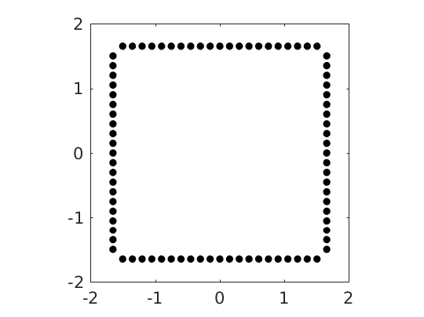
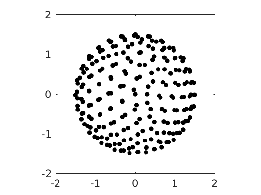
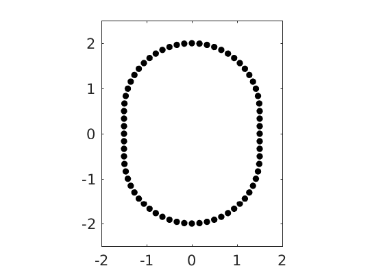
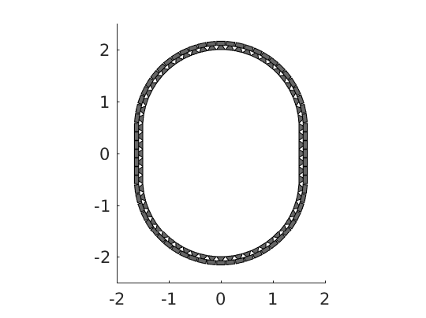
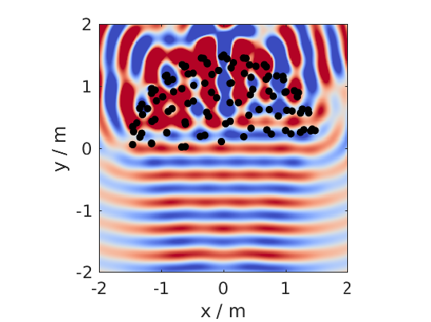
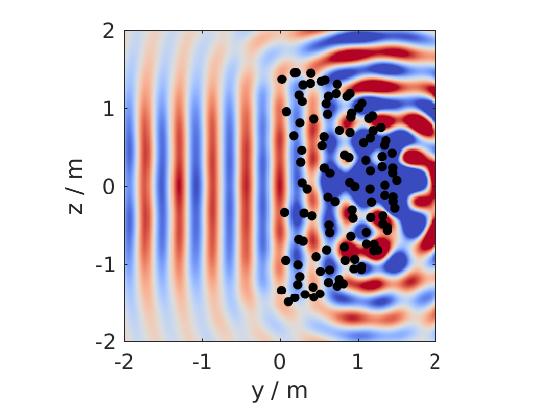
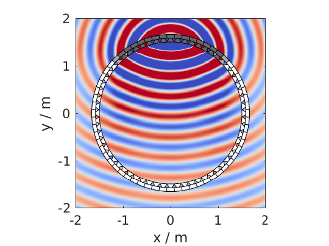
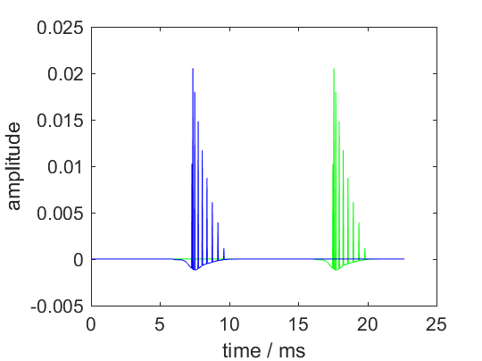

Sound Field Synthesis Toolbox
=============================

The Sound Field Synthesis Toolbox (SFS) for Matlab/Octave gives you the
possibility to play around with sound field synthesis methods like Wave Field
Synthesis (WFS) or near-field compensated Higher Order Ambisonics (NFC-HOA).
There are functions to simulate monochromatic sound fields for different secondary
source (loudspeaker) setups, time snapshots of full band impulses emitted by the
secondary source distributions, or even generate Binaural Room Scanning (BRS)
stimuli sets in order to simulate WFS with the SoundScape Renderer (SSR).

### Table of Contents

**[Installation](#installation)**  
**[Requirements](#requirements)**  
**[Usage](#usage)**  
  **[Secondary Sources](#secondary-sources)**  
    [Linear Array](#linear-array)  
    [Circular Array](#circular-array)  
    [Box Shaped Array](#box-shaped-array)  
    [Spherical Array](#spherical-array)  
    [Arbritrary Shaped Array](#arbritrary-shaped-array)  
    [Plot Loudspeaker Symbols](#plot-loudspeaker-symbols)  
  **[Simulate Monochromatic Sound Fields](#simulate-monochromatic-sound-fields)**  
    [Wave Field Synthesis](#wave-field-synthesis)  
    [Near-Field Compensated Higher Order Ambisonics](#near-field-compensated-higher-order-ambisonics)  
    [Stereo](#stereo)  
  **[Simulate Time Snapshots of Sound Fields](#simulate-time-snapshots-of-sound-fields)**  
  **[Make Binaural Simulations of Your Systems](#make-binaural-simulations-of-your-systems)**  
    [Using the SoundScape Renderer with the SFS Toolbox](#using-the-soundScape-renderer-with-the-sfs-toolbox)  
  **[Small helper functions](#small-helper-functions)**  
  **[Plotting with Matlab or gnuplot](#plotting-with-matlab-or-gnuplot)**  
**[Credits and License](#credits-and-license)**


Installation
------------

Download the Toolbox and add the main path of the Toolbox to your Matlab/Octave
path. After that copy <code>SFS_config_example.m</code> to
<code>SFS_config.m</code> and change it to your needs. For an easy beginning you
can just use the default settings by leaving everything as it is.
Then start the Toolbox with <code>SFS_start</code> which will add all needed
subpathes.


Requirements
------------

**Matlab**  
You need Matlab version 2011b or newer to run the Toolbox.
On older version the Toolbox should also work, but you need to add
[narginchk.m](http://gist.github.com/hagenw/5642886) to the
<code>SFS_helper</code>
directory.

**Octave**  
You need Octave version 3.6 or newer to run the Toolbox. In addition, 
you will need the following additional packages from 
[octave-forge](http://octave.sourceforge.net/):
* audio (e.g. for wavwrite)
* signal (e.g. for firls)

After setting up the Toolbox and can made one of the magic following things with it:

Usage
-----

### Secondary Sources

The Toolbox comes with a function which can generate different common shapes of loudspeaker arrays for you.
At the moment linear, circular, box shaped and spherical arrays are included out
of the box.

Before showing the different geometries, we start with some common settings. First we get a configuration struct
and set the array size/diameter to 3m.

```Matlab
conf = SFS_config_example;
conf.secondary_sources.size = 3;
```

#### Linear Array

```Matlab
conf = SFS_config_example;
conf.secondary_sources.geometry = 'line'; % or 'linear'
conf.secondary_sources.number = 21;
x0 = secondary_source_positions(conf);
figure;
figsize(conf.plot.size(1),conf.plot.size(2),conf.plot.size_unit);
draw_loudspeakers(x0,[1 1 0],conf);
axis([-2 2 -2 1]);
%print_png('img/secondary_sources_linear.png');
```


#### Circular Array

```Matlab
conf = SFS_config_example;
conf.secondary_sources.geometry = 'circle'; % or 'circular'
conf.secondary_sources.number = 56;
x0 = secondary_source_positions(conf);
figure;
figsize(540,404,'px');
draw_loudspeakers(x0,[1 1 0],conf);
axis([-2 2 -2 2]);
%print_png('img/secondary_sources_circle.png');
```


#### Box Shaped Array

```Matlab
conf = SFS_config_example;
conf.secondary_sources.geometry = 'box';
conf.secondary_sources.number = 84;
x0 = secondary_source_positions(conf);
figure;
figsize(540,404,'px');
draw_loudspeakers(x0,[0 0 1],conf);
axis([-2 2 -2 2]);
%print_png('img/secondary_sources_box.png');
```



#### Spherical Array

For a spherical array you need a grid to place the secondary sources on the
sphere. At the moment we provide grids with the Toolbox, that can be find here:
http://github.com/sfstoolbox/data/tree/master/spherical_grids  
You have to specify your desired grid, for example
<code>conf.secondary_sources.grid = 'equally_spaced_points'</code>. The
<code>secondary_source_positions()</code> functions will then automatically
download the desired grid from that web page and stores it under
<code><$SFS_MAIN_PATH>/data</code>. If the download is not working (which can
happen under Matlab and Windows at the moment) you can alternatively checkout or
download the whole [data repository](http://github.com/sfstoolbox/data) to the
<code>data</code> folder.

```Matlab
conf = SFS_config_example;
conf.secondary_sources.size = 3;
conf.secondary_sources.geometry = 'sphere'; % or 'spherical'
conf.secondary_sources.grid = 'equally_spaced_points';
conf.secondary_sources.number = 225;
x0 = secondary_source_positions(conf);
figure;
figsize(540,404,'px');
draw_loudspeakers(x0,[1 1 0],conf);
axis([-2 2 -2 2]);
%print_png('img/secondary_sources_sphere.png');
```



#### Arbitrary Shaped Arrays

You can create arbitrarily shaped arrays by settings the values of the single
loudspeaker directly in the <code>conf.secondary_sources.x0</code> matrix, which
has to be empty if you want to use one of the above predefined shapes. The rows
of the matrix contain the single loudspeakers and the six columns are
<code>[x y z nx ny nz w]</code>, the position and direction and weight of the
single loudspeakers. The weight <code>w</code> is a factor the driving function
of this particular loudspeaker is multiplied with in a function that calculates
the sound field from the given driving signals and secondary sources. For WFS
<code>w</code> could include the tapering window, a spherical grid weight, and
the <code>r^2 cos(theta)</code> weights for integration on a sphere.

```Matlab
conf = SFS_config_example;
% create a stadium like shape by combining two half circles with two linear
% arrays
% first getting a full circle with 56 loudspeakers
conf.secondary_sources.geometry = 'circle';
conf.secondary_sources.number = 56;
conf.secondary_sources.x0 = [];
x0 = secondary_source_positions(conf);
% store the first half cricle and move it up
x01 = x0(2:28,:);
x01(:,2) = x01(:,2) + ones(size(x01,1),1)*0.5;
% store the second half circle and move it down
x03 = x0(30:56,:);
x03(:,2) = x03(:,2) - ones(size(x03,1),1)*0.5;
% create a linear array
conf.secondary_sources.geometry = 'line';
conf.secondary_sources.number = 7;
conf.secondary_sources.size = 1;
x0 = secondary_source_positions(conf);
% rotate it and move it left
R = rotation_matrix(pi/2);
x02 = [(R*x0(:,1:3)')' (R*x0(:,4:6)')'];
x02(:,1) = x02(:,1) - ones(size(x0,1),1)*1.5;
x02(:,7) = x0(:,7);
% rotate it the other way around and move it right
R = rotation_matrix(-pi/2);
x04 = [(R*x0(:,1:3)')' (R*x0(:,4:6)')'];
x04(:,1) = x04(:,1) + ones(size(x0,1),1)*1.5;
x04(:,7) = x0(:,7);
% combine everything
conf.secondary_sources.x0 = [x01; x02; x03; x04];
% if we gave the conf.x0 to the secondary_source_positions function it will
% simply return the defined x0 matrix
x0 = secondary_source_positions(conf);
figure;
figsize(540,404,'px');
draw_loudspeakers(x0,[1 1 0],conf);
axis([-2 2 -2.5 2.5]);
%print_png('img/secondary_sources_arbitrary.png');
```




#### Plot Loudspeaker Symbols

For two dimensional setups you can plot the secondary sources with loudspeaker
symbols, for example the following will replot the last array.

```Matlab
conf.plot.realloudspeakers = true;
figure;
figsize(540,404,'px');
draw_loudspeakers(x0,conf);
axis([-2 2 -2.5 2.5]);
%print_png('img/secondary_sources_arbitrary_realloudspeakers.png');
```




### Simulate Monochromatic Sound Fields

With the files in <code>SFS_monochromatic</code> you can simulate a
monochromatic sound field in a specified area for different techniques like WFS
and NFC-HOA. The area can be a 3D cube, a 2D plane, a line or only one point.
This depends on the specification of <code>X,Y,Z</code>. For example 
<code>[-2 2],[-2 2],[-2 2]</code> will be a 3D cube;
<code>[-2 2],0,[-2 2]</code> the xz-plane; <code>[-2 2],0,0</code> a line along
the x-axis; <code>3,2,1</code> a single point.

For all 2.5D functions the configuration <code>conf.xref</code> is important as
it defines the point for which the amplitude is corrected in the sound field.
The default entry is
```Matlab
conf.xref = [0 0 0];
```

#### Wave Field Synthesis

The following will simulate the field of a virtual plane wave with a frequency
of 800 Hz going into the direction of (0 -1 0) synthesized with 3D WFS.

```Matlab
conf = SFS_config_example;
conf.dimension = '3D';
conf.secondary_sources.size = 3;
conf.secondary_sources.number = 225;
conf.secondary_sources.geometry = 'sphere';
% [P,x,y,z,x0,win] = sound_field_mono_wfs(X,Y,Z,xs,src,f,conf);
sound_field_mono_wfs([-2 2],[-2 2],0,[0 -1 0],'pw',800,conf);
%print_png('img/sound_field_wfs_3d_xy.png');
sound_field_mono_wfs([-2 2],0,[-2 2],[0 -1 0],'pw',800,conf);
%print_png('img/sound_field_wfs_3d_xz.png');
sound_field_mono_wfs(0,[-2 2],[-2 2],[0 -1 0],'pw',800,conf);
%print_png('img/sound_field_wfs_3d_yz.png');
```







You can see that the Toolbox is now projecting all the secondary source positions
into the plane for plotting them. In addition the axis are automatically chosen
and labeled.

In the next plot we use a two dimensional array, 2.5D WFS and a virtual point source
located at (0 2.5 0) m. The 3D example showed you, that the sound fields are
automatically plotted if we specify now output arguments. If we specify one, we
have to explicitly say if we want also plot the results, by
<code>conf.plot.useplot = true;</code>.

```Matlab
conf = SFS_config_example;
conf.dimension = '2.5D';
conf.plot.useplot = 1;
% [P,x,y,z,x0] = sound_field_mono_wfs(X,Y,Z,xs,src,f,conf);
[P,x,y,z,x0] = sound_field_mono_wfs([-2 2],[-2 2],0,[0 2.5 0],'ps',800,conf);
%print_png('img/sound_field_wfs_25d.png');
```


If you want to plot the whole array and not only the active secondary sources,
you can do this by adding these commands. First we store all sources in an extra
variable <code>x0_all</code>, then we get the active ones <code>x0</code> and
the corresponding indices of these active ones in <code>x0_all</code>.
Afterwards we set all sources in <code>x0_all</code> to zero, which is inactive
and only the active ones to <code>x0(:,7)</code>.

```Matlab
x0_all = secondary_source_positions(conf);
[x0,idx] = secondary_source_selection(x0_all,[0 2.5 0],'ps');
x0_all(:,7) = zeros(1,size(x0_all,1));
x0_all(idx,7) = x0(:,7);
plot_sound_field(P,x,y,z,x0_all,conf);
%print_png('img/sound_field_wfs_25d_with_all_sources.png');
```




#### Near-Field Compensated Higher Order Ambisonics

In the following we will simulate the field of a virtual plane wave with a frequency
of 800 Hz traveling into the direction (0 -1 0), synthesized with 2.5D NFC-HOA.

```Matlab
conf = SFS_config_example;
conf.dimension = '2.5D';
% sound_field_mono_nfchoa(X,Y,Z,xs,src,f,conf);
sound_field_mono_nfchoa([-2 2],[-2 2],0,[0 -1 0],'pw',800,conf);
%print_png('img/sound_field_nfchoa_25d.png');
```


#### Stereo

The Toolbox includes not only WFS and NFC-HOA, but also some generic sound field
functions that are doing only the integration of the driving signals of the
single secondary sources to the resulting sound field. With these function you
can for example easily simulate a stereophonic setup.

```Matlab
conf = SFS_config_example;
x0 = [-1 2 0 0 -1 0 1;1 2 0 0 -1 0 1];
% [P,x,y,z] = sound_field_mono(X,Y,Z,x0,src,D,f,conf)
sound_field_mono([-2 2],[-1 3],0,x0,'ps',[1 1],800,conf)
%print_png('img/sound_field_stereo.png');
```


### Simulate Time Snapshots of Sound Fields

With the files in <code>SFS_time_domain</code> you can simulate snapshots in
time of an impulse originating from your WFS or NFC-HOA system.

In the following we will create a snapshot in time after 200 samples for a broadband 
virtual point source placed at (0 2 0) m for 2.5D NFC-HOA.

```Matlab
conf = SFS_config_example;
conf.dimension = '2.5D';
conf.plot.useplot = true;
% sound_field_imp_nfchoa(X,Y,Z,xs,src,t,conf)
[p,x,y,z,x0] = sound_field_imp_nfchoa([-2 2],[-2 2],0,[0 2 0],'ps',200,conf);
%print_png('img/sound_field_imp_nfchoa_25d.png');
```


The output can also be plotted in dB by setting <code>conf.plot.usedb =
true;</code>. In this case also a color map is shown. For none dB plots no
color bar is shown in the plots. In these cases the color coding goes always from
-1 to 1, with clipping of larger values.
We change also the color map to the Matlab default one.

```Matlab
conf.plot.usedb = true;
conf.plot.colormap = 'jet';
plot_sound_field(p,x,y,z,x0,conf);
%print_png('img/sound_field_imp_nfchoa_25d_dB.png');
```


### Make Binaural Simulations of Your Systems

If you have a set of head-related transfer functions (HRTFs) you can simulate
the ear signals reaching a listener sitting at a given point in the listening
area for a specified WFS or NFC-HOA system.
You can even download a set of HRTFs, which will just work with the Toolbox at 
http://dev.qu.tu-berlin.de/projects/measurements/wiki/2010-11-kemar-anechoic

In order to easily use different HRIR sets the toolbox incorporates its own
[struct based file
format](http://dev.qu.tu-berlin.de/projects/measurements/wiki/IRs_file_format)
for HRIRs and BRIRs. The toolbox provides conversion functions for three other
free available data sets (CIPIC,MIT,Oldenburg). In the future it will
incorporate the newly advancing [SOFA HRTF file
format](http://sourceforge.net/projects/sofacoustics).

The files dealing with the binaural simulations are in the folder
<code>SFS_binaural_synthesis</code>. Files dealing with HRTFs are in the folder
<code>SFS_ir</code>. If you want to extrapolate your HRTFs to plane waves you
may also want to have a look in <code>SFS_HRTF_extrapolation</code>.

For example the following code will load our HRTF data set for a distance of 3m, then
a single impulse response for an angle of 30° is chosen from the set. If the
desired angle of 30° is not available, a linear interpolation between the next
two available angles will be applied. Afterwards a noise signal is created and convolved
with the impulse response by the <code>auralize_ir()</code> function.

```Matlab
conf = SFS_config_example;
irs = read_irs('QU_KEMAR_anechoic_3m.mat',conf);
ir = get_ir(irs,[rad(30) 0 3],'spherical',conf);
nsig = randn(44100,1);
sig = auralize_ir(ir,nsig,1,conf);
sound(sig,conf.fs);
```

To simulate the same source as a virtual point source synthesized by WFS and a
circular array with a diameter of 3 m, you have to do the following.

```Matlab
conf = SFS_config_example;
conf.secondary_sources.size = 3;
conf.secondary_sources.number = 56;
conf.secondary_sources.geometry = 'circle';
conf.dimension = '2.5D';
irs = read_irs('QU_KEMAR_anechoic_3m.mat',conf);
% ir = ir_wfs(X,phi,xs,src,irs,conf);
ir = ir_wfs([0 0 0],pi/2,[0 3 0],'ps',irs,conf);
nsig = randn(44100,1);
sig = auralize_ir(ir,nsig,1,conf);
```

Binaural simulations are also a nice way to investigate the frequency response
of your reproduction system. The following code will investigate the influence
of the pre-equalization filter in WFS on the frequency response.
For the red line the pre-filter is used and its upper frequency is set to the
expected aliasing frequency of the system (above these frequency the spectrum
becomes very noise as you can see in the figure).

```Matlab
conf = SFS_config_example;
conf.ir.usehcomp = 0;
conf.wfs.usehpre = 0;
irs = dummy_irs;
[ir1,x0] = ir_wfs([0 0 0],pi/2,[0 2.5 0],'ps',irs,conf);
conf.wfs.usehpre = 1;
conf.wfs.hprefhigh = aliasing_frequency(x0,conf);
ir2 = ir_wfs([0 0 0],pi/2,[0 2.5 0],'ps',irs,conf);
[a1,p,f] = easyfft(norm_signal(ir1(:,1)),conf);
a2 = easyfft(norm_signal(ir2(:,1)),conf);
figure;
figsize(540,404,'px');
semilogx(f,20*log10(a1),'-b',f,20*log10(a2),'-r');
axis([10 20000 -80 -40]);
set(gca,'XTick',[10 100 250 1000 5000 20000]);
legend('w/o pre-filter','w pre-filter');
xlabel('frequency / Hz');
ylabel('magnitude / dB');
%print_png('img/impulse_response_wfs_25d.png');
```



The same can be done in the frequency domain, but in this case we are not able
to set a maximum frequency of the pre-equalization filter and the whole
frequency range will be affected.

```Matlab
freq_response_wfs([0 0 0],[0 2.5 0],'ps',conf);
axis([10 20000 -20 20]);
%print_png('img/impulse_response_wfs_25d_mono.png');
```


#### Using the SoundScape Renderer with the SFS Toolbox

In addition to binaural synthesis, you may want to apply dynamic binaural
synthesis, which means you track the position of the head of the listener and
switches the used impulse responses regarding the head position. The [SoundScape
Renderer (SSR)](http://spatialaudio.net/ssr/) is able to do this. The SFS Toolbox
provides functions to generate the needed wav files containing the impulse
responses used by the SoundScape Renderer.
All functions regarding the SSR are stored in <code>SFS_ssr</code>.

```Matlab
conf = SFS_config_example;
brs = ssr_brs_wfs(X,phi,xs,src,irs,conf);
wavwrite(brs,fs,16,'brs_set_for_SSR.wav');
```


### Small helper functions

The Toolbox provides you also with a set of useful small functions.
Here the highlights are angle conversion with <code>rad()</code> and
<code>deg()</code>, FFT calculation and plotting <code>easyfft()</code>,
create noise signal <code>noise()</code>, rotation matrix
<code>rotation_matrix()</code>, multi-channel convolution
<code>convolution()</code>, nearest neighbour search
<code>findnearestneighbour()</code>, even or odd checking <code>iseven()</code>
<code>isodd()</code>, spherical bessel functions <code>sphbesselh()</code>
<code>sphbesselj()</code> <code>sphbessely()</code>.


### Plotting with Matlab or gnuplot

The Toolbox provides you with a variety of functions for plotting your simulated
sound fields <code>plot_sound_field()</code> and adding loudspeaker symbols to the
figure <code>draw_loudspeakers</code>.
If you have gnuplot installed, you can use the functions <code>gp_save_matrix.m</code>
and <code>gp_save_loudspeakers.m</code> to save your data in a way that it can
be used with gnuplot. An example use case can be found [at this plot of a plane
wave](https://github.com/hagenw/phd-thesis/tree/master/02_theory_of_sound_field_synthesis/fig2_04)
which includes the Matlab/Octave code to generate the data and the gnuplot
script for plotting it.


Credits and License
-------------------

This is the source distribution of Sound Field Synthesis Toolbox (SFS) licensed
under the GPLv3+. Please consult the file COPYING for more information about
this license.
 
For questions, bug reports and feature requests:  
Contact: sfstoolbox@googlemail.com  
Website: http://github.com/sfstoolbox/sfs

If you use the Toolbox for your publications please cite our AES Convention e-Brief:  
H. Wierstorf, S. Spors - Sound Field Synthesis Toolbox.  
In the Proceedings of *132nd Convention of the
Audio Engineering Society*, 2012  
[ [pdf](http://audio.qu.tu-berlin.de/wp-content/uploads/publications/2012/wierstorf2012_SFS_toolbox_AES.pdf) ]
[ [bibtex](doc/aes132_paper.bib) ]

Copyright (c) 2010-2015  
Quality & Usability Lab, together with  
Assessment of IP-based Applications  
Telekom Innovation Laboratories, TU Berlin  
Ernst-Reuter-Platz 7, 10587 Berlin, Germany 


Copyright (c) 2013-2015  
Institut fuer Nachrichtentechnik  
Universitaet Rostock  
Richard-Wagner-Strasse 31, 18119 Rostock
