Sound Field Synthesis Toolbox
=============================

The Sound Field Synthesis Toolbox (SFS) for Matlab/Octave gives you the
possibility to play around with sound field synthesis methods like Wave Field
Synthesis (WFS) or near-field compensated Higher Order Ambisonics (NFC-HOA).
There are functions to simulate monochromatic sound fields for different secondary
source (loudspeaker) setups, time snapshots of full band impulses emitted by the
secondary source distributions, or even generate Binaural Room Scanning (BRS)
stimuli sets in order to simulate WFS with the SoundScape Renderer (SSR).

This documentation is all about its usage, if you are interested in the
underlying mathematics you should have a look at its PDF documentation [Theory
of Sound Field
Synthesis](https://github.com/sfstoolbox/sfs-documentation/releases/latest).

**Attention:** the SFS Toolbox now incorporates
[SOFA](http://sofaconventions.org/) as file format for HRTFs which replaces the
old irs file format formerly used by the Toolbox. If you still need this
you should download [the latest version with irs file
support](https://github.com/sfstoolbox/sfs/releases/tag/1.2.0).

### Table of Contents

**[Installation](#installation)**  
**[Requirements](#requirements)**  
**[Usage](#usage)**  
  [Secondary sources](#secondary-sources)  
  [Simulate monochromatic sound fields](#simulate-monochromatic-sound-fields)  
  [Simulate time snapshots of sound fields](#simulate-time-snapshots-of-sound-fields)  
  [Custom grid for sound field simulations](#custom-grid-for-sound-field-simulations)  
  [Make binaural simulations of your systems](#make-binaural-simulations-of-your-systems)  
  [Small helper functions](#small-helper-functions)  
  [Plotting with Matlab/Octave or gnuplot](#plotting-with-matlaboctave-or-gnuplot)  
**[Credits and License](#credits-and-license)**


Installation
------------

Download the Toolbox and add the main path of the Toolbox to your Matlab/Octave
path. After that copy <code>SFS_config_example.m</code> to
<code>SFS_config.m</code> and change it to your needs. For an easy beginning you
can just use the default settings by leaving everything as it is.
Then start the Toolbox with <code>SFS_start</code> which will add all needed
subpathes.


Requirements
------------

**Matlab**
You need Matlab version 2011b or newer to run the Toolbox.
On older version the Toolbox should also work, but you need to add
[narginchk.m](http://gist.github.com/hagenw/5642886) to the
<code>SFS_helper</code>
directory.

**Octave**
You need Octave version 3.6 or newer to run the Toolbox. In addition,
you will need the following additional packages from
[octave-forge](http://octave.sourceforge.net/):
* audio (e.g. for wavwrite)
* signal (e.g. for firls)

**Impulse responses**
The Toolbox uses the [SOFA](http://sofaconventions.org/) file format for
handling impulse response data sets like HRTFs. If you want to use this
functionality you also have to install the [SOFA API for
Matlab/Octave](https://github.com/sofacoustics/API_MO), which you can add to
your paths by executing `SOFAstart`.

After setting up the Toolbox you can made one of the magic following things with it.

Usage
-----

### Secondary sources

The Toolbox comes with a function which can generate different common shapes of loudspeaker arrays for you.
At the moment linear, circular, box shaped and spherical arrays are included out
of the box.

Before showing the different geometries, we start with some common settings. First we get a configuration struct
and set the array size/diameter to 3m.

```Matlab
conf = SFS_config_example;
conf.secondary_sources.size = 3;
```

#### Linear array

```Matlab
conf = SFS_config_example;
conf.secondary_sources.geometry = 'line'; % or 'linear'
conf.secondary_sources.number = 21;
x0 = secondary_source_positions(conf);
figure;
figsize(conf.plot.size(1),conf.plot.size(2),conf.plot.size_unit);
draw_loudspeakers(x0,conf);
axis([-2 2 -2 1]);
%print_png('doc/img/secondary_sources_linear.png');
```

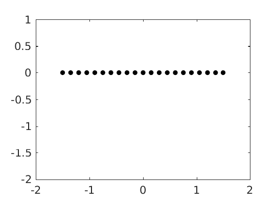

#### Circular array

```Matlab
conf = SFS_config_example;
conf.secondary_sources.geometry = 'circle'; % or 'circular'
conf.secondary_sources.number = 56;
x0 = secondary_source_positions(conf);
figure;
figsize(540,404,'px');
draw_loudspeakers(x0,conf);
axis([-2 2 -2 2]);
%print_png('doc/img/secondary_sources_circle.png');
```

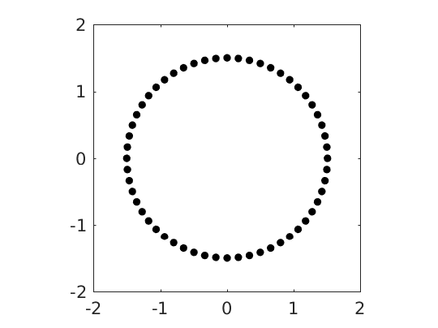

#### Box shaped array

```Matlab
conf = SFS_config_example;
conf.secondary_sources.geometry = 'box';
conf.secondary_sources.number = 84;
x0 = secondary_source_positions(conf);
figure;
figsize(540,404,'px');
draw_loudspeakers(x0,conf);
axis([-2 2 -2 2]);
%print_png('doc/img/secondary_sources_box.png');
```


#### Box shaped array with rounded edges

<code>conf.secondary_sources.edge_radius</code> defines the bending radius of
the corners. It can be chosen in a range between <code>0.0</code> and the half
of <code>conf.secondary_sources.size</code>. While the prior represents a
square box the latter yields a circle. Note that the
square box behaves it little bit different than the Box Shaped Array
since loudspeakers might also be place directly in the corners of the box.

```Matlab
conf = SFS_config_example;
conf.secondary_sources.geometry = 'rounded-box';
conf.secondary_sources.number = 84;
conf.secondary_sources.corner_radius = 0.3;
x0 = secondary_source_positions(conf);
figure;
figsize(540,404,'px');
draw_loudspeakers(x0,conf);
axis([-2 2 -2 2]);
print_png('doc/img/secondary_sources_rounded-box.png');
```

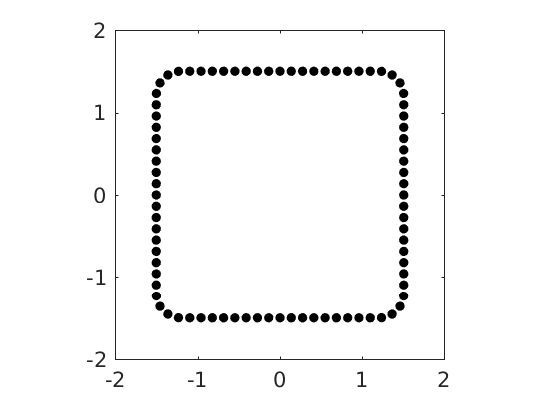

#### Spherical array

For a spherical array you need a grid to place the secondary sources on the
sphere. At the moment we provide grids with the Toolbox, that can be find here:
http://github.com/sfstoolbox/data/tree/master/spherical_grids
You have to specify your desired grid, for example
<code>conf.secondary_sources.grid = 'equally_spaced_points'</code>. The
<code>secondary_source_positions()</code> functions will then automatically
download the desired grid from that web page and stores it under
<code><$SFS_MAIN_PATH>/data</code>. If the download is not working (which can
happen under Matlab and Windows at the moment) you can alternatively checkout or
download the whole [data repository](http://github.com/sfstoolbox/data) to the
<code>data</code> folder.

```Matlab
conf = SFS_config_example;
conf.secondary_sources.size = 3;
conf.secondary_sources.geometry = 'sphere'; % or 'spherical'
conf.secondary_sources.grid = 'equally_spaced_points';
conf.secondary_sources.number = 225;
x0 = secondary_source_positions(conf);
figure;
figsize(540,404,'px');
draw_loudspeakers(x0,conf);
axis([-2 2 -2 2]);
%print_png('doc/img/secondary_sources_sphere.png');
```


#### Arbitrary shaped arrays

You can create arbitrarily shaped arrays by setting
<code>conf.secondary_sources.geometry</code> to 'custom' and define the values
of the single loudspeaker directly in the <code>conf.secondary_sources.x0</code>
matrix. The rows of the matrix contain the single loudspeakers and the six columns are
<code>[x y z nx ny nz w]</code>, the position and direction and weight of the
single loudspeakers. The weight <code>w</code> is a factor the driving function
of this particular loudspeaker is multiplied with in a function that calculates
the sound field from the given driving signals and secondary sources. For WFS
<code>w</code> could include the tapering window, a spherical grid weight, and
the <code>r^2 cos(theta)</code> weights for integration on a sphere.

```Matlab
conf = SFS_config_example;
% create a stadium like shape by combining two half circles with two linear
% arrays
% first getting a full circle with 56 loudspeakers
conf.secondary_sources.geometry = 'circle';
conf.secondary_sources.number = 56;
conf.secondary_sources.x0 = [];
x0 = secondary_source_positions(conf);
% store the first half cricle and move it up
x01 = x0(2:28,:);
x01(:,2) = x01(:,2) + ones(size(x01,1),1)*0.5;
% store the second half circle and move it down
x03 = x0(30:56,:);
x03(:,2) = x03(:,2) - ones(size(x03,1),1)*0.5;
% create a linear array
conf.secondary_sources.geometry = 'line';
conf.secondary_sources.number = 7;
conf.secondary_sources.size = 1;
x0 = secondary_source_positions(conf);
% rotate it and move it left
R = rotation_matrix(pi/2);
x02 = [(R*x0(:,1:3)')' (R*x0(:,4:6)')'];
x02(:,1) = x02(:,1) - ones(size(x0,1),1)*1.5;
x02(:,7) = x0(:,7);
% rotate it the other way around and move it right
R = rotation_matrix(-pi/2);
x04 = [(R*x0(:,1:3)')' (R*x0(:,4:6)')'];
x04(:,1) = x04(:,1) + ones(size(x0,1),1)*1.5;
x04(:,7) = x0(:,7);
% combine everything
conf.secondary_sources.geometry = 'custom';
conf.secondary_sources.x0 = [x01; x02; x03; x04];
% if we gave the conf.x0 to the secondary_source_positions function it will
% simply return the defined x0 matrix
x0 = secondary_source_positions(conf);
figure;
figsize(540,404,'px');
draw_loudspeakers(x0,conf);
axis([-2 2 -2.5 2.5]);
%print_png('doc/img/secondary_sources_arbitrary.png');
```


#### Plot loudspeaker symbols

For two dimensional setups you can plot the secondary sources with loudspeaker
symbols, for example the following will replot the last array.

```Matlab
conf.plot.realloudspeakers = true;
figure;
figsize(540,404,'px');
draw_loudspeakers(x0,conf);
axis([-2 2 -2.5 2.5]);
%print_png('doc/img/secondary_sources_arbitrary_realloudspeakers.png');
```


### Simulate monochromatic sound fields

With the files in <code>SFS_monochromatic</code> you can simulate a
monochromatic sound field in a specified area for different techniques like WFS
and NFC-HOA. The area can be a 3D cube, a 2D plane, a line or only one point.
This depends on the specification of <code>X,Y,Z</code>. For example
<code>[-2 2],[-2 2],[-2 2]</code> will be a 3D cube;
<code>[-2 2],0,[-2 2]</code> the xz-plane; <code>[-2 2],0,0</code> a line along
the x-axis; <code>3,2,1</code> a single point. If you present a range like `[-2
2]` the Toolbox will create automatically a regular grid from this ranging from
-2 to 2 with `conf.resolution` steps in between. Alternatively you could apply
a [custom grid](#custom-grid-for-sound-field-simulations) by providing a matrix
instead of the `[min max]` range for all active axes.

For all 2.5D functions the configuration <code>conf.xref</code> is important as
it defines the point for which the amplitude is corrected in the sound field.
The default entry is
```Matlab
conf.xref = [0 0 0];
```
Make sure, that this point is inside your listening area.

#### Wave Field Synthesis

The following will simulate the field of a virtual plane wave with a frequency
of 800 Hz going into the direction of (0 -1 0) synthesized with 3D WFS.

```Matlab
conf = SFS_config_example;
conf.dimension = '3D';
conf.secondary_sources.size = 3;
conf.secondary_sources.number = 225;
conf.secondary_sources.geometry = 'sphere';
% [P,x,y,z,x0,win] = sound_field_mono_wfs(X,Y,Z,xs,src,f,conf);
sound_field_mono_wfs([-2 2],[-2 2],0,[0 -1 0],'pw',800,conf);
%print_png('doc/img/sound_field_wfs_3d_xy.png');
sound_field_mono_wfs([-2 2],0,[-2 2],[0 -1 0],'pw',800,conf);
%print_png('doc/img/sound_field_wfs_3d_xz.png');
sound_field_mono_wfs(0,[-2 2],[-2 2],[0 -1 0],'pw',800,conf);
%print_png('doc/img/sound_field_wfs_3d_yz.png');
```


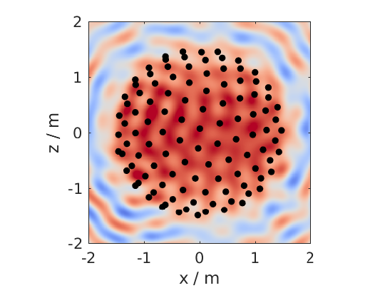


You can see that the Toolbox is now projecting all the secondary source positions
into the plane for plotting them. In addition the axis are automatically chosen
and labeled.

It is also possible to simulate and plot the whole 3D cube, but in this case no
secondary sources will be added to the plot.

```Matlab
conf = SFS_config_example;
conf.dimension = '3D';
conf.secondary_sources.size = 3;
conf.secondary_sources.number = 225;
conf.secondary_sources.geometry = 'sphere';
conf.resolution = 100;
sound_field_mono_wfs([-2 2],[-2 2],[-2 2],[0 -1 0],'pw',800,conf);
%print_png('doc/img/sound_field_wfs_3d_xyz.png');
```

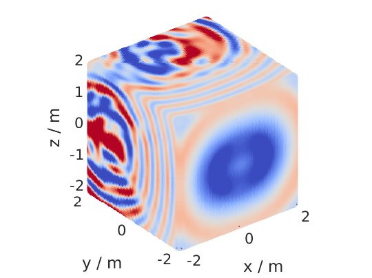


In the next plot we use a two dimensional array, 2.5D WFS and a virtual point
source located at (0 2.5 0) m. The 3D example showed you, that the sound fields
are automatically plotted if we specify now output arguments. If we specify one,
we have to explicitly say if we want also plot the results, by
<code>conf.plot.useplot = true;</code>.

```Matlab
conf = SFS_config_example;
conf.dimension = '2.5D';
conf.plot.useplot = true;
conf.plot.normalisation = 'center';
% [P,x,y,z,x0] = sound_field_mono_wfs(X,Y,Z,xs,src,f,conf);
[P,x,y,z,x0] = sound_field_mono_wfs([-2 2],[-2 2],0,[0 2.5 0],'ps',800,conf);
%print_png('doc/img/sound_field_wfs_25d.png');
```

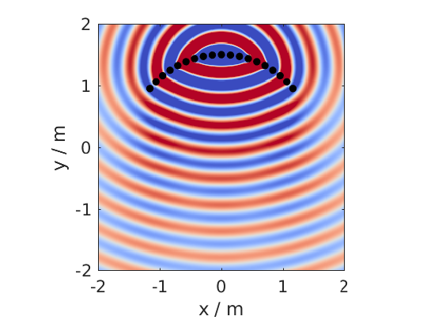

If you want to plot the whole loudspeaker array and not only the active
secondary sources, you can do this by adding these commands. First we store all
sources in an extra variable <code>x0_all</code>, then we get the active ones
<code>x0</code> and the corresponding indices of these active ones in
<code>x0_all</code>.  Afterwards we set all sources in <code>x0_all</code> to
zero, which is inactive and only the active ones to <code>x0(:,7)</code>.

```Matlab
x0_all = secondary_source_positions(conf);
[x0,idx] = secondary_source_selection(x0_all,[0 2.5 0],'ps');
x0_all(:,7) = zeros(1,size(x0_all,1));
x0_all(idx,7) = x0(:,7);
plot_sound_field(P,x,y,z,x0_all,conf);
%print_png('doc/img/sound_field_wfs_25d_with_all_sources.png');
```


#### Near-Field Compensated Higher Order Ambisonics

In the following we will simulate the field of a virtual plane wave with a frequency
of 800 Hz traveling into the direction (0 -1 0), synthesized with 2.5D NFC-HOA.

```Matlab
conf = SFS_config_example;
conf.dimension = '2.5D';
% sound_field_mono_nfchoa(X,Y,Z,xs,src,f,conf);
sound_field_mono_nfchoa([-2 2],[-2 2],0,[0 -1 0],'pw',800,conf);
%print_png('doc/img/sound_field_nfchoa_25d.png');
```

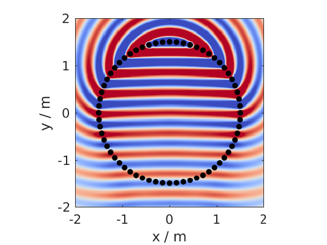


#### Local Wave Field Synthesis

In NFC-HOA the aliasing frequency in a small region inside the listening area
can be increased by limiting the used order. A similar outcome can be achieved
in WFS by applying so called local Wave Field Synthesis. In this case the
original loudspeaker array is driven by WFS to create a virtual loudspeaker
array consisting of focused sources which can then be used to create the desired
sound field in a small area. The settings are the same as for WFS, but a new
struct <code>conf.localsfs</code> has to be filled out, which for example
provides the settings for the desired position and form of the local region with
higher aliasing frequency, have a look into `SFS_config_example.m` for all
possible settings.

```Matlab
conf = SFS_config_example;
conf.resolution = 1000;
conf.dimension = '2D';
conf.secondary_sources.geometry = 'box';
conf.secondary_sources.number = 4*56;
conf.secondary_sources.size = 2;
conf.localsfs.vss.size = 0.4;
conf.localsfs.vss.center = [0 0 0];
conf.localsfs.vss.geometry = 'circular';
conf.localsfs.vss.number = 56;
% sound_field_mono_localwfs(X,Y,Z,xs,src,f,conf);
sound_field_mono_localwfs([-1 1],[-1 1],0,[1.0 -1.0 0],'pw',7000,conf);
axis([-1.1 1.1 -1.1 1.1]);
%print_png('doc/img/sound_field_localwfs_2d.png');
```

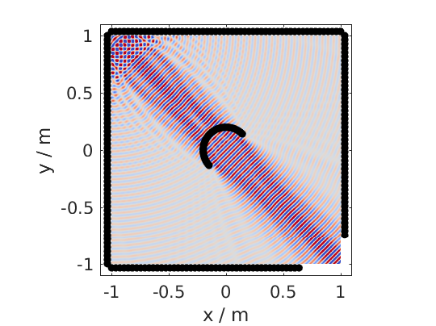


#### Stereo

The Toolbox includes not only WFS and NFC-HOA, but also some generic sound field
functions that are doing only the integration of the driving signals of the
single secondary sources to the resulting sound field. With these function you
can for example easily simulate a stereophonic setup. In this example we set the
`conf.plot.normalisation = 'center';` configuration manually as the amplitude of
the sound field is too low for the default `'auto'` setting to work.

```Matlab
conf = SFS_config_example;
conf.plot.normalisation = 'center';
x0 = [-1 2 0 0 -1 0 1;1 2 0 0 -1 0 1];
% [P,x,y,z] = sound_field_mono(X,Y,Z,x0,src,D,f,conf)
sound_field_mono([-2 2],[-1 3],0,x0,'ps',[1 1],800,conf)
%print_png('doc/img/sound_field_stereo.png');
```
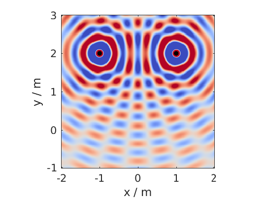


### Simulate time snapshots of sound fields

With the files in <code>SFS_time_domain</code> you can simulate snapshots in
time of an impulse originating from your WFS or NFC-HOA system.

In the following we will create a snapshot in time after 200 samples for a broadband
virtual point source placed at (0 2 0) m for 2.5D NFC-HOA.

```Matlab
conf = SFS_config_example;
conf.dimension = '2.5D';
conf.plot.useplot = true;
% sound_field_imp_nfchoa(X,Y,Z,xs,src,t,conf)
[p,x,y,z,x0] = sound_field_imp_nfchoa([-2 2],[-2 2],0,[0 2 0],'ps',200,conf);
%print_png('doc/img/sound_field_imp_nfchoa_25d.png');
```

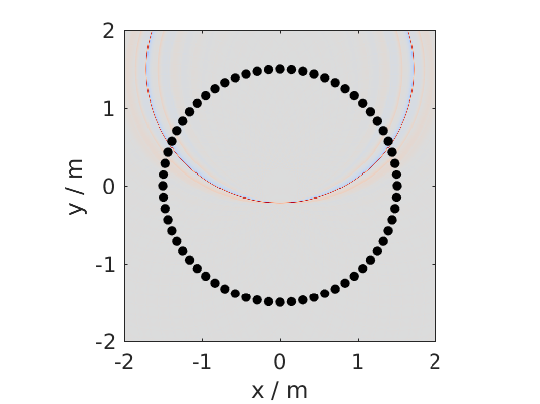

The output can also be plotted in dB by setting <code>conf.plot.usedb =
true;</code>. In this case the default color map is changed and a color bar
is plotted in the figure. For none dB plots no color bar is shown in the plots.
In these cases the color coding goes always from -1 to 1, with clipping of
larger values.

```Matlab
conf.plot.usedb = true;
plot_sound_field(p,x,y,z,x0,conf);
%print_png('doc/img/sound_field_imp_nfchoa_25d_dB.png');
```

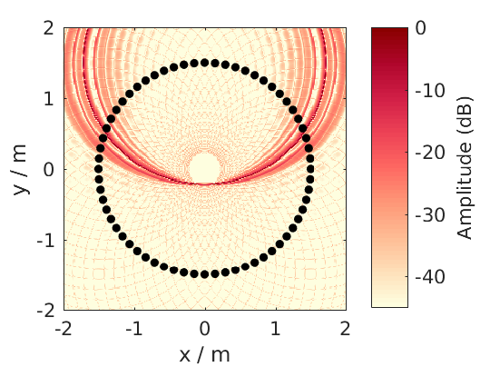

You could change the color map yourself doing the following before the plot
command.

```Matlab
conf.plot.colormap = 'jet'; % Matlab rainbow color map
```

### Custom grid for sound field simulations

As stated earlier you can provide the sound field simulation functions a custom
grid instead of the `[min max]` ranges. Again, you can provide it for one
dimension, two dimensions, or all three dimensions.

```Matlab
conf = SFS_config_example;
conf.dimension = '3D';
conf.secondary_sources.number = 225;
conf.secondary_sources.geometry = 'sphere';
conf.resolution = 100;
conf.plot.normalisation = 'center';
X = randi([-2000 2000],125000,1)/1000;
Y = randi([-2000 2000],125000,1)/1000;
Z = randi([-2000 2000],125000,1)/1000;
sound_field_mono_wfs(X,Y,Z,[0 -1 0],'pw',800,conf);
%print_png('doc/img/sound_field_wfs_3d_xyz_custom_grid.png');
conf.plot.usedb = true;
conf.dimension = '2.5D';
conf.secondary_sources.number = 64;
conf.secondary_sources.geometry = 'circle';
sound_field_imp_nfchoa(X,Y,0,[0 2 0],'ps',200,conf);
%print_png('doc/img/sound_field_imp_nfchoa_25d_dB_custom_grid.png');
```

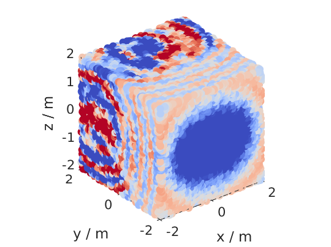

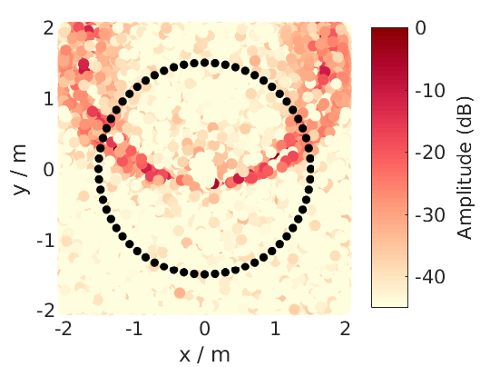


### Make binaural simulations of your systems

If you have a set of head-related transfer functions (HRTFs) or binaural room
impulse responses (BRIRs) you can simulate the ear signals reaching a listener
sitting at a given point in the listening area for different spatial audio
systems.

In order to easily use different HRTF or BRIR sets the Toolbox uses the [SOFA file
format](http://sofaconventions.org). In order to use it you have to install the
[SOFA API for Matlab/Octave](https://github.com/sofacoustics/API_MO) and run
`SOFAstart` before you can use it inside the SFS Toolbox.  If you are looking
for different HRTFs and BRIRs, a large set of different impulse responses is
available:
http://www.sofaconventions.org/mediawiki/index.php/Files.

The files dealing with the binaural simulations are in the folder
<code>SFS_binaural_synthesis</code>. Files dealing with HRTFs and BRIRs are in
the folder <code>SFS_ir</code>. If you want to extrapolate your HRTFs to plane
waves you may also want to have a look in the folder
<code>SFS_HRTF_extrapolation</code>.

In the following we present some examples of binaural simulations. For their
auralization an anechoic recording of a cello is used, which can be downloaded
from
[anechoic_cello.wav](https://dev.qu.tu-berlin.de/projects/twoears-database/repository/revisions/master/raw/stimuli/anechoic/instruments/anechoic_cello.wav).


#### Binaural simulation of arbitrary loudspeaker arrays

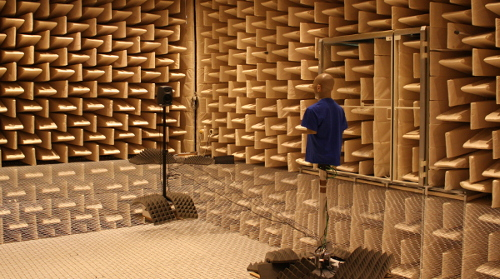

If you use an HRTF data set, it has the advantage that it was recorded in
anechoic conditions and the only parameter that matters is the relative position
of the loudspeaker to the head during the measurement. This advantage can be
used to create every possible loudspeaker array you can imagine, given that the
relative locations of all loudspeakers are available in the HRTF data set.  The
above picture shows an example of a HRTF measurement. You can download the
corresponding
[QU_KEMAR_anechoic_3m.sofa](https://github.com/sfstoolbox/data/raw/master/HRTFs/QU_KEMAR_anechoic_3m.sofa)
HRTF set, which we can directly use with the Toolbox.

The following example will load the HRTF data set and
extracts a single impulse response for an angle of 30° from it. If
the desired angle of 30° is not available, a linear interpolation between the
next two available angles will be applied. Afterwards the impulse response will
be convolved with the cello recording by the <code>auralize_ir()</code>
function.

```Matlab
conf = SFS_config_example;
hrtf = SOFAload('QU_KEMAR_anechoic_3m.sofa');
ir = get_ir(hrtf,[0 0 0],[0 0],[rad(30) 0 3],'spherical',conf);
cello = wavread('anechoic_cello.wav');
sig = auralize_ir(ir,cello,1,conf);
sound(sig,conf.fs);
```

To simulate the same source as a virtual point source synthesized by WFS and a
circular array with a diameter of 3 m, you have to do the following.

```Matlab
conf = SFS_config_example;
conf.secondary_sources.size = 3;
conf.secondary_sources.number = 56;
conf.secondary_sources.geometry = 'circle';
conf.dimension = '2.5D';
hrtf = SOFAload('QU_KEMAR_anechoic_3m.sofa');
% ir = ir_wfs(X,phi,xs,src,hrtf,conf);
ir = ir_wfs([0 0 0],pi/2,[0 3 0],'ps',hrtf,conf);
cello = wavread('anechoic_cello.wav');
sig = auralize_ir(ir,cello,1,conf);
```

If you want to use binaural simulations in listening experiments, you should
not only have the HRTF data set, but also a corresponding headphone compensation
filter, which was recorded with the same dummy head as the HRTFs and the
headphones you are going to use in your test. For the HRTFs we used in the last
example and the AKG K601 headphones you can download
[QU_KEMAR_AKGK601_hcomp.wav](https://raw.githubusercontent.com/sfstoolbox/data/master/headphone_compensation/QU_KEMAR_AKGK601_hcomp.wav).
If you want to redo the last simulation with headphone compensation, just add
the following lines before calling `ir_wfs()`.

```Matlab
conf.ir.usehcomp = true;
conf.ir.hcompfile = 'QU_KEMAR_AKGK601_hcomp.wav';
conf.N = 4096;
```

The last setting ensures that your impulse response will be long enough for
convolution with the compensation filter.


#### Binaural simulation of a real setup


Besides simulating arbitrary loudspeaker configurations in an anechoic space,
you can also do binaural simulations of real loudspeaker setups. In the
following example we use BRIRs from the 64-channel loudspeaker array of the
University Rostock as shown in the panorama photo above. The BRIRs and
additional information on the recordings are available for download, see
[doi:10.14279/depositonce-87.2](http://dx.doi.org/10.14279/depositonce-87.2).

```Matlab
conf = SFS_config_example;
brir = 'BRIR_NoAbsorbers_ArrayCentre_Emitters1to64.sofa';
conf.secondary_sources.geometry = 'custom';
conf.secondary_sources.x0 = brir;
ir = ir_wfs([0 0 0],0,[3 0 0],'ps',brir,conf);
cello = wavread('anechoic_cello.wav');
sig = auralize_ir(ir,cello,1,conf);
```

In this case, we don't load the BRIRs into the memory with `SOFAload()` as the
file is too large. Instead, we make use of the ability that SOFA can request
single impulse responses from the file by just passing the file name to the
`ir_wfs()` function. Note, that the head orientation is chosen to be `0` instead
of `pi/2` as in the HRTF examples due to a difference in the orientation of
the coordinate system of the BRIR measurement.


#### Frequency response of your spatial audio system

Binaural simulations are also a nice way to investigate the frequency response
of your reproduction system. The following code will investigate the influence
of the pre-equalization filter in WFS on the frequency response.  For the red
line the pre-filter is used and its upper frequency is set to the expected
aliasing frequency of the system (above these frequency the spectrum becomes
very noise as you can see in the figure).

```Matlab
conf = SFS_config_example;
conf.ir.usehcomp = false;
conf.wfs.usehpre = false;
hrtf = dummy_irs(conf);
[ir1,x0] = ir_wfs([0 0 0],pi/2,[0 2.5 0],'ps',hrtf,conf);
conf.wfs.usehpre = true;
conf.wfs.hprefhigh = aliasing_frequency(x0,conf);
ir2 = ir_wfs([0 0 0],pi/2,[0 2.5 0],'ps',hrtf,conf);
[a1,p,f] = easyfft(norm_signal(ir1(:,1)),conf);
a2 = easyfft(norm_signal(ir2(:,1)),conf);
figure;
figsize(540,404,'px');
semilogx(f,20*log10(a1),'-b',f,20*log10(a2),'-r');
axis([10 20000 -80 -40]);
set(gca,'XTick',[10 100 250 1000 5000 20000]);
legend('w/o pre-filter','w pre-filter');
xlabel('frequency / Hz');
ylabel('magnitude / dB');
%print_png('doc/img/impulse_response_wfs_25d.png');
```


The same can be done in the frequency domain, but in this case we are not able
to set a maximum frequency of the pre-equalization filter and the whole
frequency range will be affected.

```Matlab
freq_response_wfs([0 0 0],[0 2.5 0],'ps',conf);
axis([10 20000 -40 0]);
%print_png('doc/img/impulse_response_wfs_25d_mono.png');
```


#### Using the SoundScape Renderer with the SFS Toolbox

In addition to binaural synthesis, you may want to apply dynamic binaural
synthesis, which means you track the position of the head of the listener and
switches the used impulse responses regarding the head position. The [SoundScape
Renderer (SSR)](http://spatialaudio.net/ssr/) is able to do this. The SFS Toolbox
provides functions to generate the needed wav files containing the impulse
responses used by the SoundScape Renderer.
All functions regarding the SSR are stored in <code>SFS_ssr</code>.

```Matlab
conf = SFS_config_example;
brs = ssr_brs_wfs(X,phi,xs,src,hrtf,conf);
wavwrite(brs,fs,16,'brs_set_for_SSR.wav');
```


### Small helper functions

The Toolbox provides you also with a set of useful small functions.
Here the highlights are angle conversion with <code>rad()</code> and
<code>deg()</code>, FFT calculation and plotting <code>easyfft()</code>,
create noise signal <code>noise()</code>, rotation matrix
<code>rotation_matrix()</code>, multi-channel convolution
<code>convolution()</code>, nearest neighbour search
<code>findnearestneighbour()</code>, even or odd checking <code>iseven()</code>
<code>isodd()</code>, spherical bessel functions <code>sphbesselh()</code>
<code>sphbesselj()</code> <code>sphbessely()</code>.


### Plotting with Matlab/Octave or gnuplot

The Toolbox provides you with a variety of functions for plotting your simulated
sound fields <code>plot_sound_field()</code> and adding loudspeaker symbols to
the figure <code>draw_loudspeakers</code>.  If you have gnuplot installed, you
can use the functions <code>gp_save_matrix.m</code> and
<code>gp_save_loudspeakers.m</code> to save your data in a way that it can be
used with gnuplot. An example use case can be found [at this plot of a plane
wave](https://github.com/hagenw/phd-thesis/tree/master/02_theory_of_sound_field_synthesis/fig2_04)
which includes the Matlab/Octave code to generate the data and the gnuplot
script for plotting it.


Credits and license
-------------------

This is the source distribution of Sound Field Synthesis Toolbox (SFS) licensed
under the GPLv3+. Please consult the file COPYING for more information about
this license.

Website: http://github.com/sfstoolbox/sfs

If you have questions, bug reports or feature requests, please use the [Issue
Section on the website](https://github.com/sfstoolbox/sfs/issues) to report them.

If you use the Toolbox for your publications please cite our AES Convention
e-Brief and/or the DOI you will find for the [official
releases](https://github.com/sfstoolbox/sfs/releases):  
H. Wierstorf, S. Spors - Sound Field Synthesis Toolbox.
In the Proceedings of *132nd Convention of the
Audio Engineering Society*, 2012
[ [pdf](http://audio.qu.tu-berlin.de/wp-content/uploads/publications/2012/wierstorf2012_SFS_toolbox_AES.pdf) ]
[ [bibtex](doc/aes132_paper.bib) ]

Copyright (c) 2010-2015
Quality & Usability Lab, together with
Assessment of IP-based Applications
Telekom Innovation Laboratories, TU Berlin
Ernst-Reuter-Platz 7, 10587 Berlin, Germany

Copyright (c) 2013-2015
Institut fuer Nachrichtentechnik
Universitaet Rostock
Richard-Wagner-Strasse 31, 18119 Rostock
